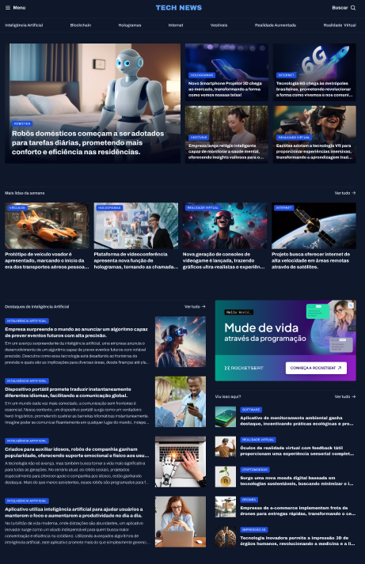

<h1 align="center"> Página de Noticias </h1>

<a href="https://debstd22.github.io/portal-noticias/">Acesse o projeto finalizado clicando aqui</a>

   <a href="#objetivo-do-projeto">Objetivo do Projeto</a>&nbsp;&nbsp;&nbsp;|&nbsp;&nbsp;&nbsp;
   <a href="#tecnologias-utilizadas">Tecnologias Utilizadas</a>&nbsp;&nbsp;&nbsp;|&nbsp;&nbsp;&nbsp;
   <a href="#funcionalidades">Funcionalidades</a>&nbsp;&nbsp;&nbsp;|&nbsp;&nbsp;&nbsp;
   <a href="#layout">Layout</a>&nbsp;&nbsp;&nbsp;

&nbsp;

&nbsp;

## Objetivo do Projeto

Este projeto foi desenvolvido com o objetivo de colocar em prática os conhecimentos adquiridos durante as aulas de CSS da Rocketseat, por meio da criação de uma página de notícias sobre tecnologia. A proposta foi estruturar e estilizar o conteúdo de forma organizada, aplicando boas práticas de marcação semântica e design visual.

## Tecnologias Utilizadas

- HTML5  
- CSS3  
- Git 

## Funcionalidades

- Estruturação semântica de uma página de notícias
- Utilização de CSS Grid para organização do layout principal
- Exibição de conteúdos organizados por categorias (Inteligência Artificial, Blockchain, etc.)
- Seção de destaques principais
- Cards de notícias com imagens e descrições
- Menu de navegação e campo de busca
- Estilização completa da página com CSS
- Organização visual para melhorar a experiência do usuário

## Layout

Você pode visualizar o layout do projeto <a href="https://www.figma.com/design/UXoUQqC57ZW63PkjJjDZHP/Portal-de-not%C3%ADcias--Community---Copy-?t=qmvBZONLtjVnXNRS-0">CLICANDO AQUI</a>. É necessário ter conta do <a href="https://www.figma.com/login?is_not_gen_0=true">FIGMA</a> para acessá-lo.